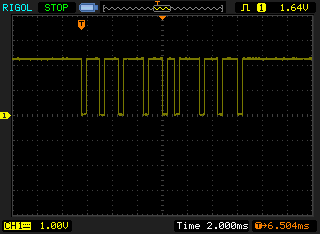

# test_ppm_decode

This project provides an example for using the 
[ppm_decode](https://crates.io/crates/ppm_decode)
with a real microcontroller and the rust embedded HAL.
This has been tested on the 
[Pixracer](https://docs.px4.io/v1.9.0/en/flight_controller/pixracer.html)
autopilot board with the FrSky X4R(sb) RC receiver.

## Example

In this example we're receiving CPPM signals from a FrSky X4R 
RC receiver configured to output CPPM for channels 1-8 on 
its CH1 pins. (See your receiver's instructions for 
configuring in this mode during binding.) 
This is oscilloscope capture of the actual FrSky output: 

We configure a Pixracer (stm32f4) board to capture PPM pulses
with microsecond resolution and hand those to the ppm_decoder.

## Status

- [x] Configure free-running microsecond timer
- [x] Configure RCIN input pin capture
- [x] Enable the Pixracer's hardware inverter for the RCIN signal (FrSky CPPM is inverted)
- [x] Capture PPM pulse edges consistently in an interrupt handler
- [x] Provide PPM edge timing to `ppm_decode`
- [x] Read frames from ppm decoder 

